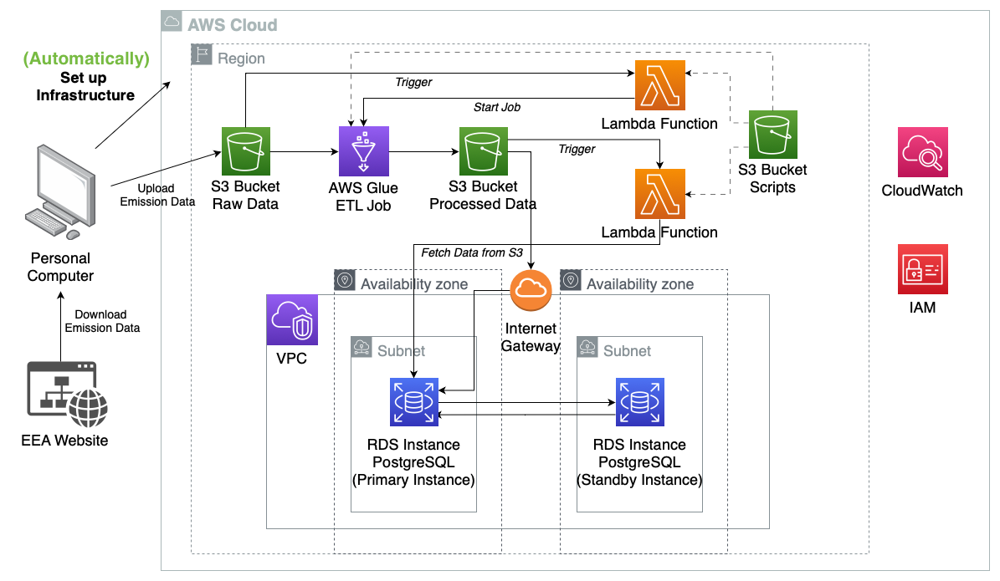
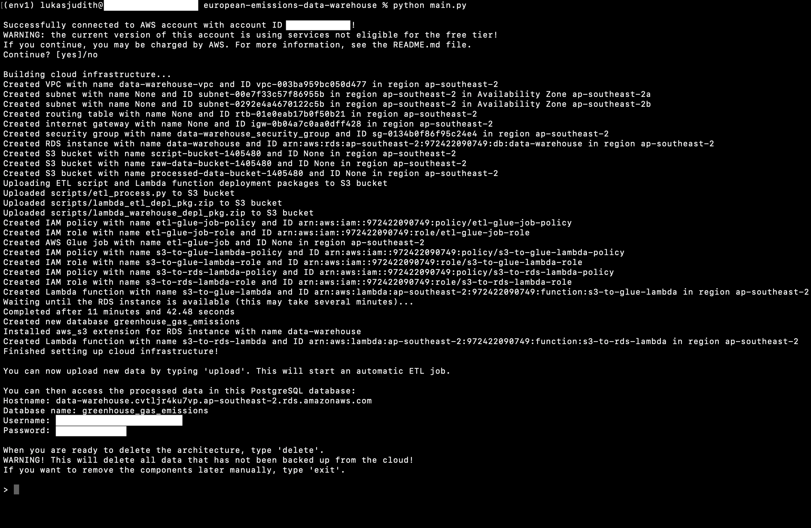
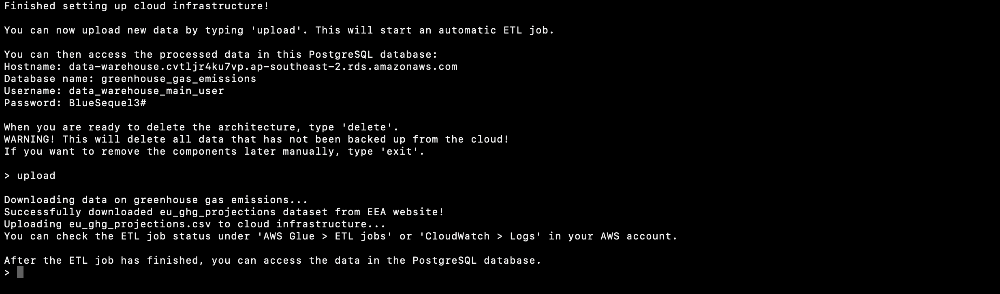
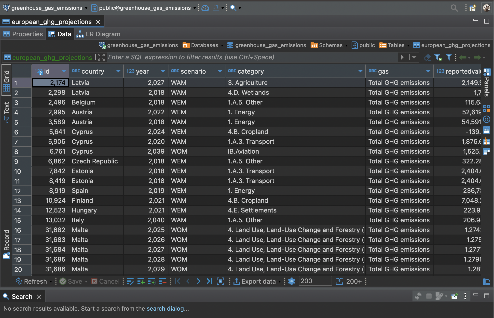
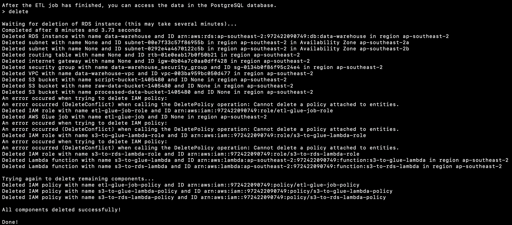

# Data Warehouse for European GHG Emissions

In this project, the AWS (Amazon Web Services) Python SDK is used to automatically set up a data warehouse in the cloud for cleaning and storing greenhouse gas (GHG) emission data, which is obtained from the website of the [European Environment Agency (EEA)](https://www.eea.europa.eu/en).  

***Disclaimer**: this is an experimental project to improve and showcase my current skills in cloud computing and data engineering and is not in any way meant to represent a full software solution for applications other than personal use.*

The code in `main.py` sets up all components of the warehouse, as illustrated in the diagram in Fig. 1 below. During an interactive command line session, data can then easily be downloaded from the official EEA website and uploaded to the cloud infrastructure. This automatically triggers an ETL job that cleans and transforms the data using PySpark, and then uploads it to a PostgreSQL database. For robust and highly available storage of the processed data, the architecture features [multi-AZ deployment](https://aws.amazon.com/rds/features/multi-az/) of the RDS instance.

Note that AWS services are generally **not free of charge**, so the personal use of this project may lead to charges to your account. For important information regarding **billing, security and Data Specifications**, as well as instructions on how to run the code and for a brief code demonstration, refer to the [table of contents](#Table-of-Contents).



*Fig. 1: Diagram for the data warehouse architecture in the AWS cloud. Diagram created using [draw.io](https://www.drawio.com).* 


----


## Table of Contents

1. [Important Information](#Important-Information)

   1. [Data Specifications](#Data-Specifications)
   2. [Security](#Security)
   3. [Billing in AWS](#Billing-in-AWS)
2. [Brief Code Documentation](#Brief-Code-Documentation)
3. [How to Use the Code](#How-to-Use-the-Code)
4. [Code Demonstration](#Code-Demonstration)
5. [Planned Updates](#Planned-Updates)
6. [Contact and Feedback](#Contact-and-Feedback)


----


### Important Information

#### Data Specifications

The dataset used for this project contains projections of the total greenhouse gas emissions as submitted by the individual European countries, gathered by the [European Environment Agency (EEA)](https://www.eea.europa.eu/en). The data was last updated in 2022 (as of May 2023) and can be found [on the EEA website](https://www.eea.europa.eu/en/datahub/datahubitem-view/4b8d94a4-aed7-4e67-a54c-0623a50f48e8), along with its metadata fact sheet. Estimations were made for different years between 2015 and 2050 for different emission sources and scenarios (see below) and are given in kt CO2 equivalent.

The dataset is downloaded as a CSV file with ~30.000 rows and a size of ~7 MB.

**Sources of emissions (main categories)**:

1. Energy 
2. Industrial Processes
3. Agriculture
4. Land Use, Land-Use Change and Forestry
5. Waste

**Scenarios**:

1. With currently existing measures to reduce emissions (WEM)
2. Without measures (WOM)
3. With additional measures (WAM)

#### Security 

In order to work properly, the code requires an **access key **and a **secret key** that can be generated in your AWS account (see [How to Use the Code](#How-to-use-the-Code)). These keys are needed to set up infrastructure in your AWS account programmatically. The code in this repository **does not** pass on your credentials to any third party and uses the keys only for the purpose of creating and deleting the data warehouse infrastructure. To avoid any potential security risks, you can **delete the key pair** right after you are done using the code.

#### Billing in AWS

In general, using AWS infrastructure comes at a cost. AWS offers a [free tier](https://aws.amazon.com/free), and this project is designed to reduce incurring cost and use as many services (as well instance types and respective amounts of data) eligible for the free tier as possible. Two notable exceptions are multi-AZ deployment of the RDS instance and AWS Glue jobs, which are not (currently, as of May 2023) included in the free tier. Therefore, using the current version of this code can lead to small charges to your account, even if you have the free tier.

*The creator of this project does not take any responsibility for incurring charges to your account.*

You can [set up a billing alarm](https://docs.aws.amazon.com/AmazonCloudWatch/latest/monitoring/monitor_estimated_charges_with_cloudwatch.html), e.g. for when the estimated cost exceeds USD1.00. For more information on pricing of different AWS services, refer to the official [website](https://aws.amazon.com/pricing). Note that due to the chosen services and the amount of data, incurring costs should be minimal. This depends, however, on the number of times and the duration for which you run the code. To reduce any expenses, delete the infrastructure as soon as you are done using it (the code does this automatically).

**Note**: Future versions of this code are planned to include a version fully relying on free-tier services.


### Brief Code Documentation

*Note that this section does not serve as a full documentation of the code and is (in its current state) only meant to give a brief overview of the different components of this project.*

#### aws_details_template.json

Config file into which you have to enter your AWS access key and secret key (see [How to Use the Code](#How-to-use-the-Code)) and a database master username and password of your choice. **Has to be renamed to *aws_details.json***.

#### main.py

The main script that builds the data warehouse in your AWS account, using the Python wrapper classes from the [aws_service_classes module](#aws_service_classes.py). Starts an interactive terminal section that allows the user to interact with the cloud infrastructure. Provides error handling for the case that the execution of the code is interrupted and for any error that cannot be intercepted by the error handling provided by the wrapper classes.

#### aws_service_classes.py

Contains Python wrapper classes (built on top of the boto3 SDK for AWS) for easily creating, deleting and interacting with the different AWS services used for this data warehouse. Features error handling for each class that informs the user when something goes wrong when creating the infrastructure, without interrupting the program.

#### data_downloader.py

Short script that uses the requests library to download the CSV dataset from the EEA website. See [Data Specifications](#Data-Specifications). 

#### utils.py

Collection of some general useful functions used in the other scripts.

#### scripts (folder)

Contains the PySpark script for the ETL Glue job and the deployment packages for the Lambda functions. The deployment packages (.zip files) are created using the *create_deployment_packages* bash script and a Dockerfile based on the public Docker image for the public AWS Lambda python:3.8-x86_64 Docker image (this ensures that the dependencies are installed for the correct Python version and architecture). It should not be neccessary for you to run this script yourself, as the deployment packages are included already. 

#### configs (folder)

Contains JSON files specifiying the configurations of IAM policies and security groups used in this project.


### How to Use the Code

**<u>NOTE: before using the code, see [Security](#Security) and [Billing in AWS](#Billing-in-AWS)!</u>**

1. If you do not have an AWS account, you can sign up [here](https://aws.amazon.com/free/?trk=134e1094-886f-46f2-9b73-043b6167f58e&sc_channel=ps&ef_id=Cj0KCQjwyLGjBhDKARIsAFRNgW-roMQ7yKNv2OEaOpsYbMDw8znQzeY9-VzbOel-ovLuKF_veXcjZFAaAtFuEALw_wcB:G:s&s_kwcid=AL!4422!3!656400517632!p!!g!!aws!20039308241!148673368979&all-free-tier.sort-by=item.additionalFields.SortRank&all-free-tier.sort-order=asc&awsf.Free%20Tier%20Types=*all&awsf.Free%20Tier%20Categories=*all) for free.

2. Make sure to first set up an [IAM user with admin credentials](https://docs.aws.amazon.com/IAM/latest/UserGuide/getting-set-up.html#create-an-admin). It is not recommended to use the root user.

3. Log into your AWS account (as the IAM admin user) and generate an access key and secret access key pair:

   --> navigate to Identity and Access Management (IAM) (enter IAM into the search bar) 

   --> Users --> *choose your IAM user* --> Create access key

   **Note**: make sure to delete this key pair after using this code to avoid any potential security risk.

4. Fill in your credentials and preferred [region](https://docs.aws.amazon.com/awsconsolehelpdocs/latest/gsg/select-region.html#) into the aws_details_template.json. 

5. Rename the file to aws_details.json.

6. Create a new conda environment (make sure you have [installed conda](https://conda.io/projects/conda/en/latest/user-guide/install/index.html)) and install the required dependencies:

   ```
   conda create --name {your_environment_name} python=3.8
   conda activate {your_environment_name}
   pip install -r requirements.txt
   ```

7. Run the script to set up the cloud infrastructure and start the interactive session:

   ```
   python main.py
   ```

   You can now upload the data and delete the infrastructure again once you're done using this project. 

   **Note**: it can take a while for the database to be active (usually somewhere between 5 and 15 minutes...) and for it to be deleted again later, in order to save you the trouble of deleting them manually via the AWS Management Console (web interface).

   **Note**: The program can also be interrupted using CTRL+C; in that case, any AWS service that has been created before will be deleted (again, to save you the trouble of deleting them manually).

   

### Code Demonstration

After executing the script `main.py`, the user should see the following printout in the command line while the cloud infrastructure is being set up:



*Fig. 2: Command line with interactive session after creating cloud infrastructure.*

The process may take a few minutes, specifically waiting for the RDS instance to become available usually takes several minutes. Subsequently, an interactive session will be started in the command line in which the user has the choice of uploading data by typing *upload*, deleting the infrastructure via *delete*, or simply exiting the program using *exit*.

**WARNING**: when exiting without the *delete* command, you will have to delete all created AWS services manually! Without deleting the infrastructure (either by using *delete*, or manually), the warehouse will cause **ongoing incurring cost to your AWS account**!

*In case of any errors while setting up the cloud infrastructure, e.g. if your credential are invalid or if your internet connection is unstable, the program will provide error messages to assist you in fixing the problem.*

Once the user has given the *upload* command, the data will be downloaded from the EEA website and uploaded to an S3 bucket (raw data bucket) in the cloud warehouse:



*Fig. 3: Interactive session after uploading the EEA data to the cloud.*

It may be necessary to wait for a short time (usually about 1-2 minutes) until the lambda functions and ETL job have been executed successfully. Afterwards, the data should be available in the PostgreSQL database. It can then be accessed with various tools, such as [DBeaver](https://dbeaver.io):



*Fig. 4: Excerpt of the processed data in PostgreSQL database, accessed using DBeaver.*

At this stage, the processed data can be extracted from the database using SQL queries for futher analysis and visualisation (planned for a future version). 

Afterwards, the infrastructure can be removed by using the *delete* command. This first shuts down and deletes the RDS instance (in the current version, no backups or snapshots are saved, so the processed data ist lost), and then the rest of the AWS services making up the data warehouse. 

**WARNING**: when exiting without the *delete* command, you will have to delete all created AWS services manually! Without deleting the infrastructure (either by using *delete*, or manually), the warehouse will cause **ongoing incurring cost to your AWS account**!

*If any deletion fails (e.g. when trying to delete components in the wrong order), the program will continue to delete the other services/instances and then try again.*

The user is presented with this final printout:



*Fig. 5: Command line after successfully deleting the infrastructure.*


### Planned Updates

- Add visualisations with Jupyter Notebooks and interactive elements/widgets, using SQL queries to access the clean data stored in the RDS database
- Add option to save backups of database
- Combine several Data Sources, e.g.:
  - Create new table with general information about each country
  - Add similar emission projections for the United Kingdom
- Replace infrastructure to enable a completely free use of this code
  - Disable RDS multi-AZ deployment by choice
  - Replace AWS Glue by choice (e.g. with Lambda function using pandas for small amounts of data)
- Code demonstrations in case of errors


### Contact and Feedback

I appreciate any feedback or other types of input/comments on this project!

Feel free to reach out to me at lukasjudith12@gmail.com, connect on LinkedIn at https://www.linkedin.com/in/lukas-judith/, and check out my personal website at https://lukas-judith.github.io!


